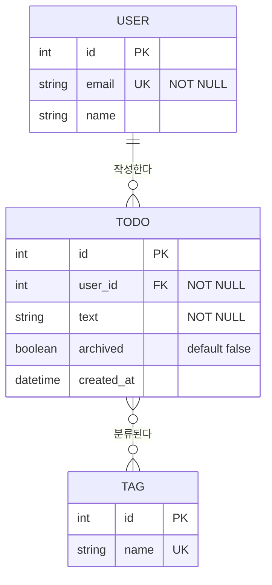

## 한 줄 정의
개체-관계 다이어그램 — **무엇을 저장하고(엔터티), 그것들이 서로 어떻게 연결되는지(관계)**를 그림으로 고정한 데이터 모델 문서.

## 자세히
ERD는 세 가지로 이루어진다. **엔터티**(저장 대상. 보통 테이블), **속성**(엔터티가 가진 필드), **관계**(엔터티 사이의 연결과 그 개수 규칙). 이 중 실제 설계 논쟁이 벌어지는 곳은 거의 항상 **관계의 개수 규칙(cardinality)**이다.

| 표기 | 뜻 | 예 |
|---|---|---|
| 1:1 | 하나에 하나 | 사용자 — 프로필 |
| 1:N | 하나에 여럿 | 사용자 — 게시글 |
| N:M | 여럿에 여럿 (중간 테이블 필요) | 게시글 — 태그 |

여기에 **선택성(optionality)**이 붙는다. "게시글은 반드시 작성자를 가진다"와 "가질 수도 있다"는 전혀 다른 스키마가 되고(`NOT NULL` 여부), 전혀 다른 코드가 된다. ERD를 그리는 실질적 이유가 이것이다 — 말로는 대충 넘어가지는 이 구분이 그림에서는 넘어가지지 않는다.

ERD를 언제 그리느냐도 중요하다. [PRD](/posts/prd/)와 [유저 스토리](/posts/user-story/)가 나온 **뒤**에 그려야 한다. 데이터 모델을 먼저 정하면 "이 테이블이 있으니 이 기능도 넣자"는 식으로 요구사항이 스키마에 끌려간다. 반대 순서를 지키면 스키마는 실제로 필요한 것만 갖게 된다 — [YAGNI](/posts/yagni/)가 데이터 층에도 그대로 적용된다.

바꾸기 비용이 코드보다 훨씬 크다는 점도 기억할 만하다. 함수는 나중에 리팩터링하면 되지만, 운영 중인 테이블 구조는 마이그레이션 + 데이터 이관 + 다운타임 문제를 동반한다. 그래서 ERD는 "지금 필요한 최소"로 시작하되, **관계 구조만큼은 신중히** 정한다. 컬럼 추가는 싸고, 1:N을 N:M으로 바꾸는 건 비싸다.

작성 도구는 크게 상관없다. 요즘은 Mermaid `erDiagram` 처럼 텍스트로 그려 [시스템 설계 문서](/posts/system-design-document/)에 그대로 심는 방식이 편하다 — 코드 리뷰에 diff가 남기 때문이다.

## 예시

읽는 법:
- `USER ||--o{ TODO` = 사용자 1명이 할 일 0개 이상을 가진다 (1:N, 할 일은 작성자 필수)
- `TODO }o--o{ TAG` = N:M → 실제 구현 시 `TODO_TAG` 중간 테이블이 생긴다
- `archived` 를 컬럼으로 둘지 별도 `ARCHIVE` 테이블로 뺄지는 [결정 기록](/posts/decision-record/)에 남길 만한 판단

## 관련
- [시스템 설계 문서](/posts/system-design-document/) — ERD가 그 일부이거나 그로부터 분리되는 상위 문서
- [PRD](/posts/prd/) · [유저 스토리](/posts/user-story/) — ERD보다 먼저 확정되어야 하는 문서
- [결정 기록](/posts/decision-record/) — 스키마 선택의 근거를 남기는 문서(ADR)
- [YAGNI](/posts/yagni/) — 안 쓸 테이블·컬럼을 미리 만들지 않는 근거
- [상관관계행렬](/posts/correlation-matrix/) — 같은 데이터를 관계 관점에서 보는 다른 도구(분석용)
